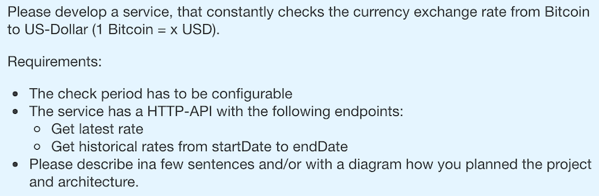
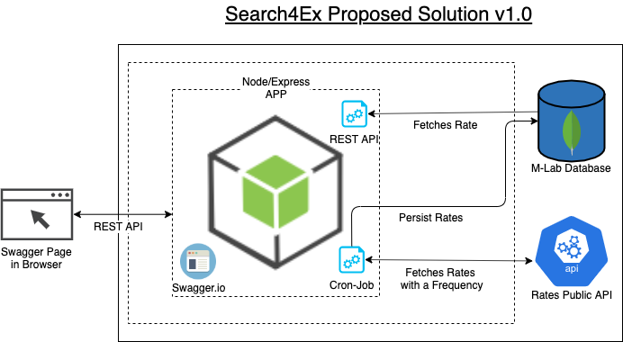
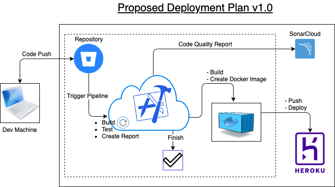

# Search4Ex #
----
- _Original repository can be found at [search4ex@bitbucket](https://bitbucket.org/naeem_astro/search4ex)_
- _[Bitbucket Pipelines](https://bitbucket.org/naeem_astro/search4ex/addon/pipelines/home)_
- _[Bitbucket Deployments](https://bitbucket.org/naeem_astro/search4ex/addon/pipelines/deployments)_
- _For Heroku App Logs Run in terminal:_ `heroku logs -n 200 -a search4ex`
----

Demonstration of Requirements understanding, proposing a solution and implementation by using the latest tools and techniques. The code is based on Google Android SDK.

### What is this repository for? ###

* This app is built as assignment for searchmetrics. 
* Adds different libs to enhance the application quality and performance.
* Using [SWAGGER.IO](www.swagger.io) for documentation and as a working REST-API client
* CI/CD Demonstration
* Version 1.0.0

### Problem Statement:

### Proposed Solution:

### Deployment:

### Development Cycle:
- Distributes the whole development into Issues
- Go through the [Bitbucket Issues Page](https://bitbucket.org/naeem_astro/search4ex/issues)

### Application Flow ###

- A: Open [doc](https://search4ex.herokuapp.com/api-docs/) page in the browser
- B: Check API's
- C: User can set the CRON frequency from a given set of values
- D: User can check the latest exchange rate of Bitcoin against US Dollar
- J: **It will update the rate into database after a set amount of time by using cron-job**

## How do I get set up? ##

### How to set up ###
To set-up the project locally you need to clone this repo, from `master` or `develop` branch or some latest `TAG`

### Configuration ###

Please sync and resolve dependencies by using
- `npm install`

Set environment variables:
- `cp .env.example .env`

### Start App
- `npm run dev`
- You may access the app on [`http://localhost:3000`](http://localhost:5000/api-docs)

### Build Docker Image
- `docker build -t search4ex .`

### Run Docker Image
- Run `docker run -d -p 5000:5000 search4ex`
- You may access the running docker app on [`http://localhost:5000/api-docs`](http://localhost:5000/api-docs)

### Stop Docker Container
- Run `docker kill {container-id}`

### Pre-reqs

- [nodejs](https://nodejs.org)
- [npm](www.npmjs.com/‎)
- [MongoDB](https://www.mongodb.com)
- [Docker](https://www.docker.com/)
- [Bitbicket](www.bitbucket.org)
- [Bitbicket-pipelines](https://bitbucket.org/product/features/pipelines)
- [Heroku](https://dashboard.heroku.com/)

## Requirements ##

- See [`package.json`](/package.json)
- [Express](https://expressjs.com/)
- [Nodemon](https://nodemon.io/)
- [MongoDB](https://www.mongodb.com)
- [JEST](https://jestjs.io)

## Major Libraries and tools included: ##

- Jest
- Mongoose
- MockgooseReactiveX/RxAndroid)
- Winston
- Supertest
- joi
- swagger-jsdoc
- swagger-ui-express
- node-cron

## Storage ##
### Local Storage ###

- `Environment Variable` to hold the index of value for the cron-job frequency

### Remote Storage ###

- Using [M-Lab](www.mlab.com) for live storage

#### Auth ####
- No auth is used for this version, thouhg we have a structure to implement along with swagger documentation

## External Tools: ##

- **Pipelines**: [Bitbicket-pipelines](https://bitbucket.org/product/features/pipelines)
- **Build-Packaging**: [Docker](https://www.docker.com/)
- **Deployment**: [Heroku](https://dashboard.heroku.com/)
- **API Monitoring**: [assertible](https://assertible.com/)

## Code Quality ##

- `Jest`
- `Istanbol Coverage`
- `SonarCloud`

## Distribution ##

The project can be distributed using a docker image or as git-repo.

## Deployment ##
- Access the App from [https://search4ex.herokuapp.com/api-docs/](https://search4ex.herokuapp.com/api-docs/)
- Access the code analysis report: [SonarCloud](https://sonarcloud.io/dashboard?id=Naeem_search4ex)
- Heroku App Logs: Run `heroku logs -n 200 -a search4ex`

## Limitation
- [M-Lab](www.mlab.com) is a free service up to 500mb data volume.
- Using Bitbucket Free resources for pipeline executions.
- Using Heroku free tier, all the apps in free tiers as required to shut-down at least 6 hours a day.
- I am using [assertible](https://assertible.com/) to keep the app alive on Heroko.

## Contribution guidelines ##

- Forks are always appreciated
